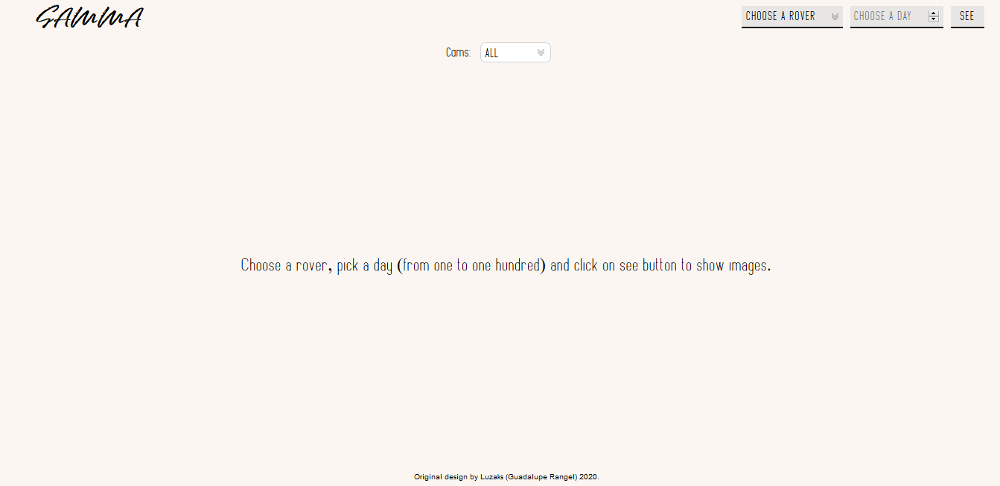
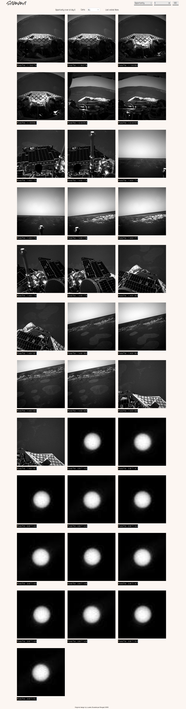
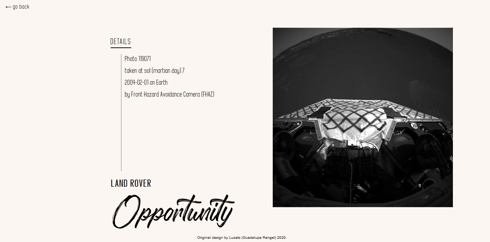

# 🖼️ Gamma Gallery - React Capstone Project 🖼️

[<p align="center">Live Version</p>](https://gamma-gallery.netlify.app/)

## 📝 Table of Contents

* [About the Project](#about-the-project)
  * [Gamma Gallery](#gamma-gallery)
    * [Landing Page](#-landing-page)
    * [Gallery Catalog](#-gallery-catalog)
    * [Details Page](#-details-page)
* [Available Scripts](#available-scripts)
* [Getting Started](#getting-started)
* [Built With](#built-with)
* [Contact](#contact)
* [Acknowledgements](#acknowledgements)

<!-- ABOUT THE PROJECT -->
## 👉 About The Project

This Capstone Project was completely built with [Create React App](https://github.com/facebook/create-react-app) and it is the final project for React/Redux course.

The purpose of this project is to present a proposal of a catalog React/Redux single application that fetch data from an external API. 
You should be able to filter the received data and access to the details of the selected item.  

To make this happen, the app should use client side routes for displaying the details of the apps pages.

The complete project's assignment can be seen [here](https://www.notion.so/Catalogue-of-Recipes-ea589778a95f47fa98034d99d4016d2b).

## 👉 Gamma Gallery

Gamma gallery is my proposal for the required assignments. It consists in a catalog of photos taken by the land rovers that inhabits mars, the chosen API is the NASA Open APIs Mars Rover Photos and the client side router used is React Router Dom. 
The style of the catalog its a minimalistic monochromatic one, giving importance and protagonism to the black and white photographs.

### 👉 Landing Page

In Gamma Gallery the pages are generated dynamically by choosing the preferred rover and the martian day after clicking on the navigation bar's seen button.
You can choose between different options.

    For Rovers you have:
    
      *  Curiosity.
      *  Opportunity.
      *  Spirit.  
      
    For martian days you can choose:
    
      *  From day one to the one thousand.  
    

<p align="center">Preview Image</p>
<div align="center"></div>

### 👉 Gallery Catalog

After choosing between the options and clicking the see button, a menu will be displayed with the information of the chosen data and the cameras filter, the data includes the rover, the day and the last visited photograph.
The cameras filter it's upgrated every time that you ask for a different rover, and you will be able to filter photos by the current rover's cameras.

The photos are presented on the screen with a label below them, the text shown is the photo's ID uniq number.  
Every photo can be clicked in order to get the data details of every one of them.
It's this link the one that uses the client side route that will display the corresponding photo's data.

<p align="center">Preview Image</p>
<div align="center"></div>

### 👉 Details Page

After clicking on the wanted photograph you will see a page with a more proper size of the photograph and the details of it. 
The details include the full name of the camera and the equivalent Earth date of the picture.
You can return to the gallery by clicking in the go back link and continue exploring.

<p align="center">Preview Image</p>
<div align="center"></div>


## Available Scripts

In the project directory, you can run, in :

1.- For activate the web-server watcher `./bin/webpack-dev-server`

2.- For starting the web-server `npm start`

2.- For installing dependencies `npm i`

3.- Outside the web-server, for running tests `npm test`

Runs the app in the development mode.<br />
Open [http://localhost:3000](http://localhost:3000) to view it in the browser.

The page will reload if you make edits.<br />
You will also see any lint errors in the console.

## Getting started

*   Click on the green button, in the repository. 
*   Add the following commands in your favorite bash:
```
git clone [copied text]
cd [repo name]
npm i
npm start
```

A tab will be opened in your default browser.

### 🛠 Built With

*   React.js 
*   Redux
*   Redux Dev Tools
*   React-Router-Dom
*   Axios
*   JSX
*   Bootstrap
*   Styled Components
*   Prop-Types
*   CSS
*   Netlify
*   ES6
*   npm
*   Eslint
*   [NASA Open Apis](https://api.nasa.gov/)

<!-- CONTACT & SUPPORT -->
## Contact & Support

🙍 Guadalupe Rangel - kanemekanik@gmail.com - ☄

You liked it? ⭐️ Star the project!!!

Any comment that you want to send I'll be happy to receive it.

## Acknowledgments

[Microverse](https://www.microverse.org/)
[NASA](https://api.nasa.gov/)

This project is for learning purposes. I don't own any image presented here.
